Rstudio es un entorno de desarrollo interactivo (IDE) de R, un programa utilizado para el tratamiento y análisis datos en varios formatos. En este documento te explicaremos como instalarlo y sus funciones básicas.

## Instalación de R

1. Visita la página [https://cran.rstudio.com/](https://cran.rstudio.com/)

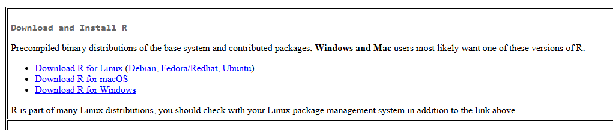


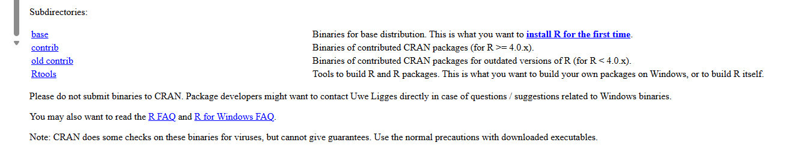


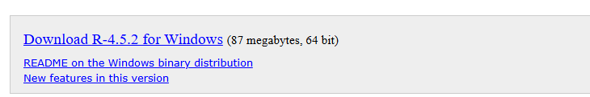

2. Un archivo R-4.5.2.exe (o similar) se descargará en tu ordenador. Deberías ser capaz de encontrarlo en la parte superior derecha (en el caso de Google Chrome) o en general yendo al explorador de archivos -> Descargas.

3. Clica sobre el archivo. Esto iniciará un proceso de instalación, puedes dejar todas las opciones por defecto.

¡Enhorabuena ya has instalado R! Ahora nos falta instalar Rstudio, esto es un entorno en el que no será (más) fácil utilizar las funciones que tiene R.

## Instalación de Rstudio

1. Visita la página [https://posit.co/download/rstudio-desktop/](https://posit.co/download/rstudio-desktop/). En función de vuestro sistema operativo os saldrá una de las siguientes opciones

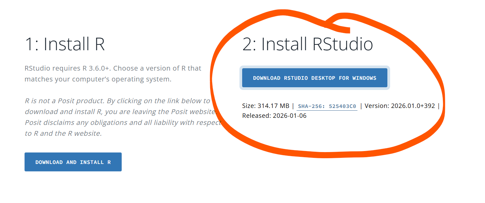


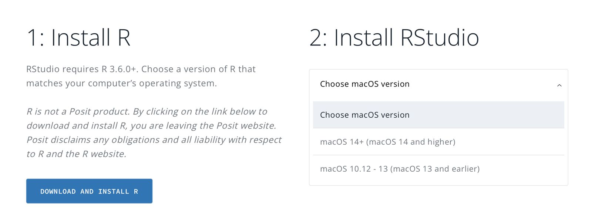

2. Un archivo Rstudio-2026.01.0-392.exe (o similar) se descargará en tu ordenador. Instalalo igual que lo has hecho con R.

¡Enhorabuena ya has instalado Rstudio!

### Primera visita a Rstudio

Busca el programa Rstudio en tu ordenador. Al abrirlo, debería aparecer una pestaña.

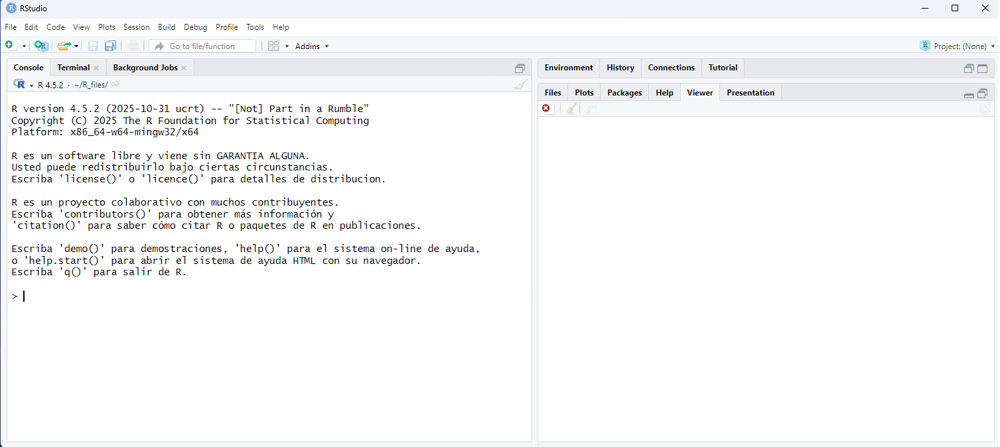


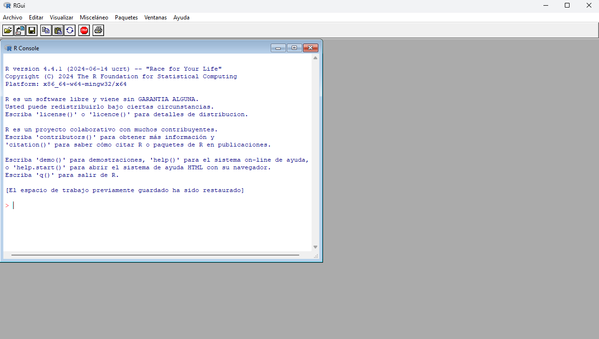


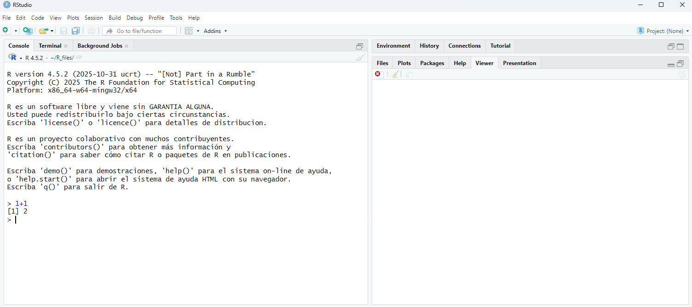


### Nuestro primer script

A continuación vamos a programar por primera vez. Para ello vamos a crear un R script. 

1. Ve a la pestaña superior izquierda File -> New File -> R script.

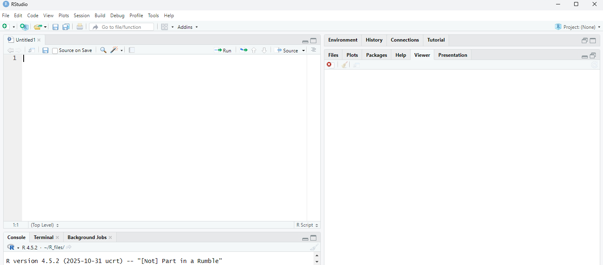

Sobre este script podemos ejecutar código usando el botón Run o, sobre la línea haciendo Control + Enter (manteniendo el botón Control pulsar Enter). Prueba las operaciones +, -, *, /, ^ y combinalas para ver el resultado. R respeta la prioridad habitual (potencias, multiplicación/división, suma/resta). Si quieres evitar ambigüedades, usa paréntesis.

Nos puede interesar, tras hacer una operación, realizar nuevas operaciones sobre el resultado. Para este fin disponemos de *variables*. 

Una *variable* es un “contenedor” con un nombre donde guardas un dato para poder reutilizarlo después. En R se suele usar el operador <- (se lee “asignar a”) para guardar un valor en una variable.


```{r}
a <-2
```

Podemos guardar el resultado de operaciones en las variables y a su vez operar con variables

```{r}
a <- 5
b <- 3
c <- a*b
c #ejecutar una línea formada por la variable nos da su valor
```
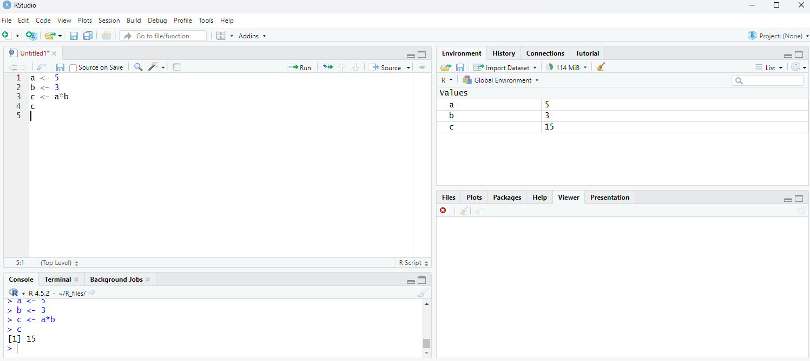


<span style="color: red;">NUNCA</span> uséis espacios o acentos en los nombres de las variables. Para dar espaciado siempre es mejor usar "_". Por ejemplo **min_glucosa**.

Para no perder nuestro trabajo es importane guardar el script. Si os fijás en la parte superior izquierda del script aparecerá un nombre (Untitled1\*) el símbolo \* indica que el archivo no se ha guardado. Untitled (sin nombre) es el nombre que se da a un archivo que no se ha guardado todavía. 

Para guardar el archivo hay que clicar sobre el botón de guardado (azul). Nos preguntará en qué dirección queremos guardar el archivo y con qué nombre. Sed ordenador y cread una carpeta para la asignatura, subcarpetas para las diferentes sesiones y ¡recordad dónde lo guardáis! No uséis carpetas con espacios en los nombres.

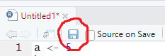


## Más tipos de variables


Hasta ahora hemos visto variables que solo tienen números, pero estas admiten muchos más tipos de información. Por ejemplo texto

```{r}
x <- "Texto de ejemplo"
x
```
El uso de texto en nuestro caso será principalmente para guardar nombres o etiquetas. 

Por otro lado podemos contruir vectores de datos. Para definir un vector usamos la notación c(...).

```{r}
x <- c(1.1, 1.2, 1.5) # vector de números
y <- c(0.1,2.7,-16)
z <- c("a","b","c") # vector de texto
```
Probad con diferentes vectores de números como actúan las operaciones +, -, *, ^. 

También tiene una colección de operaciones propias.

```{r}
mean(x)    # media
sum(x)     # suma
min(x)     # mínimo
max(x)     # máximo
length(x)  # número de datos
```

También disponemos de operaciones lógicas en diferentes tipos de variables.

```{r}
a <- 1
b <- 2
a == b  # igualdad
a > b   # mayor 
a != b  # diferencia

```
El resultado es una variable Booleana/Lógica con dos posibles valores TRUE (verdadera) y FALSE (falso).

A lo largo del curso veremos otros tipos de datos (Data frames, factors,..) formatos (.csv, .xlsx,...) y herramientas para manejarlos (paquetes).

## Conclusión

RStudio incluye una gran variedad de herramientas que iremos viendo a lo largo del curso. Os animamos a explorar el programa para ir interiorizando su funcionamiento y acostumbraros a programar. 

